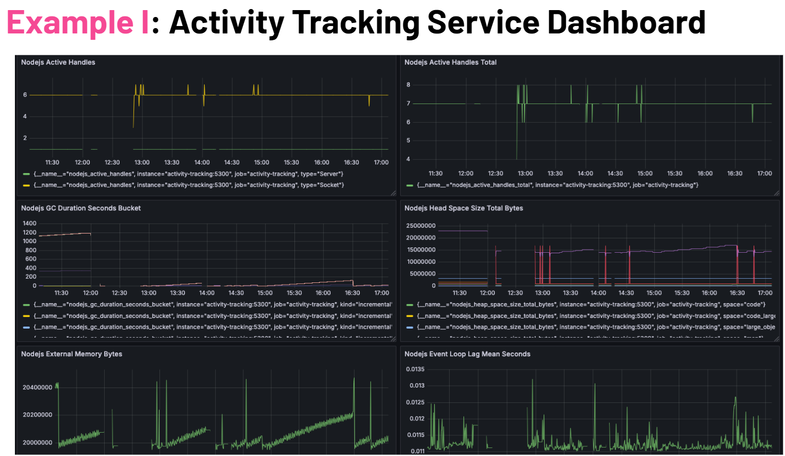

# Activity Tracking Service

## Table of Contents
- [Intro](#intro)
- [Features](#features)
- [Technologies Used](#technologies-used)
- [Setup](#setup)
- [Running the Application](#running-the-application)
  - [Start with Docker Compose](#start-with-docker-compose)
  - [Stop the Service](#stop-the-service)

- [Project Structure](#project-structure)
  - [Centralized API Calls](#centralized-api-calls)
  - [NGINX Configuration and Usage](#nginx-configuration-and-usage)
  - [Reusable Components](#reusable-components)
  - [Utils Folder](#utils-folder)
  - [Routing Enhancements](#routing-enhancements)

- [API Endpoints](#api-endpoints)
  - [Retrieve All Exercises](#retrieve-all-exercises)
  - [Add a New Exercise](#add-a-new-exercise)
  - [Retrieve an Exercise by ID](#retrieve-an-exercise-by-id)
  - [Delete an Exercise by ID](#delete-an-exercise-by-id)
  - [Update an Exercise by ID](#update-an-exercise-by-id)
  - [Strengths](#strengths)
  - [Potential Improvements](#potential-improvements)
- [Role of NGINX in the Frontend](#role-of-nginx-in-the-frontend)
- [Running Tests and Linting](#running-tests-and-linting)
  - [Unit and Integration Tests](#unit-and-integration-tests)
  - [Accessibility Standards](#accessibility-standards)
- [Focus on Error Handling](#focus-on-error-handling)
- [Metrics and Monitoring](#metrics-and-monitoring)


### Intro
The Activity Tracking Service is a microservice designed to help users log and track activities efficiently. It supports logging of various activity types, retrieving activity history, and managing activity records.

## Features
- Log Activities: Users can log activities with details like type, duration, and date.
- Retrieve Activities: Users can fetch all or specific activities by ID.
- Update Activities: Users can update activity details.
- Delete Activities: Users can delete activities they no longer need.

[Back to Table of Contents](#table-of-contents)

### Technologies Used
The project leverages the following technologies:

- MongoDB: For data storage.
- Express.js: For building the RESTful API.
- Node.js: As the runtime environment.
- Cypress: For end-to-end testing.
- Jest: For unit and intergration testing
- Winston: For structured logging and error tracking.

[Back to Table of Contents](#table-of-contents)

### Setup
#### Prerequisites
- Node.js (Version 18.x or later)
- MongoDB (Local or cloud instance)
- Docker (Optional, for containerized deployment)
- npm (Version 10.x or later)

[Back to Table of Contents](#table-of-contents)

### Running the Application
```sh
npm install
nodemon server
```

#### To run/build with Docker Compose
- **Building the service**
```sh
docker-compose build activity-tracking
```

- **Start the service**
```sh
docker-compose up activity-tracking
```

- **Stop the service**
```sh
docker-compose down activity-tracking
```

[Back to Table of Contents](#table-of-contents)

### Project Structure

#### Centralized API Calls
- API calls are handled through clearly defined routes in `routes/` to ensure separation of concerns.
For example, all activity-related operations are in `routes/exercises.js`.
#### NGINX Configuration and Usage
- NGINX is configured as a reverse proxy for routing API requests to their respective microservices.
- Example configuration includes caching for static files and CORS handling.
#### Reusable Components
- Components like `rate-limiter.js` and `logging.js` provide reusable logic for monitoring and request control.
#### Utils Folder
- Includes helper utilities for database setup (`setup.js`) and teardown (`teardown.js`).
#### Routing Enhancements
- Routes in `routes/exercises.js` implement RESTful principles and include validation and error handling.

[Back to Table of Contents](#table-of-contents)

### To run the tests
To run Jest tests
```sh
npm run test
```

To run Cypress tests, use either of the below
```sh
npm run cy:open

npm run cy:run
```

[Back to Table of Contents](#table-of-contents)

### API Endpoints

#### Retrieve all exercises
- URL: /exercises/
- Method: GET

#### Add a new exercise
- URL: /exercises/add
- Method: POST
- Request Body:
```json
{
    "username": "username",
    "exerciseType": "Running",
    "description": "5k Run",
    "duration": "30",
    "date": "2024-10-15T14:40:35.364Z"
}
```

#### Retrieve an exercise by ID
- URL: /exercises/:id
- Method: GET

#### Delete an exercise by ID
- URL: /exercises/:id
- Method: DELETE

#### Update an exercise by ID
- URL: /exercises/update/:id
- Method: PUT 
- Request Body:
```json
{
    "username": "username",
    "description": "5k Run",
    "duration": "30",
    "date": "2024-10-15T14:40:35.364Z"
}
```
#### Strengths

**Scalability:**
- Built on Node.js and Express, ensuring lightweight and scalable performance.
- Modular architecture allows for easy expansion or addition of new features.

**Security:**
- Rate limiting prevents abuse.
- Helmet provides basic security against common vulnerabilities.

**Integration:**
- Can seamlessly integrate with other services like authentication or analytics via REST APIs or NGINX proxying.

**Developer-Friendly:**
- Easy-to-understand RESTful API design.
- Comprehensive error messages aid debugging.
- Prometheus metrics simplify performance monitoring.

#### Potential Improvements

**Authorization:**
- Currently lacks user-level access control
- Adding JWT-based authentication or API key verification would enhance security

[Back to Table of Contents](#table-of-contents)

### Accessibility Standards
Focus on accessible routing and components to ensure compliance with WCAG standards.

### Focus on Error Handling
The service uses Winston for structured logging and provides detailed error messages for API failures. Errors are logged with stack traces for easy debugging.

### Metrics and Monitoring
The /metrics endpoint, powered by Prometheus, provides insights into service performance. Use it to monitor request rates, latencies, and other metrics.



[Back to Table of Contents](#table-of-contents)