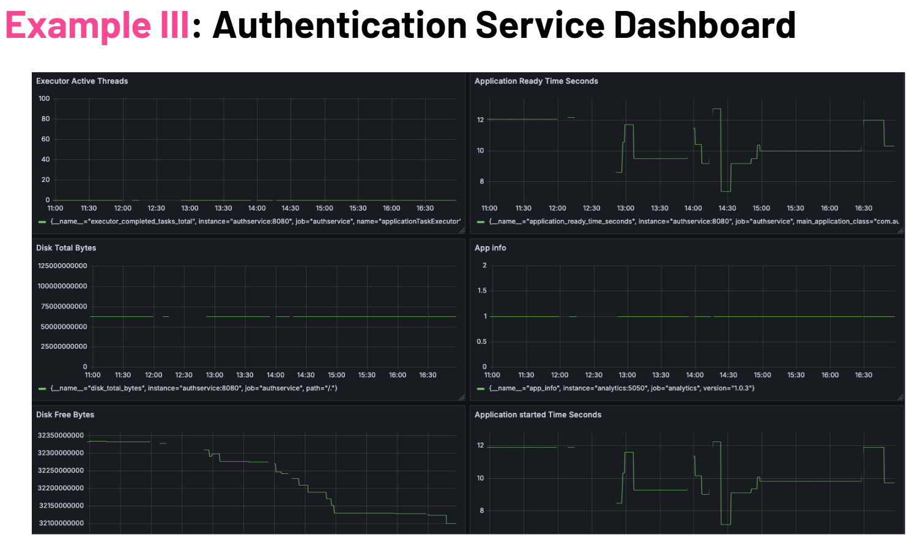

# Authservice


## Table of Contents

- [Intro](#intro)
- [Features](#features)
- [Technology Used](#technology-used)
- [API Endpoints](#api-endpoints)
- [Running the Application](#running-the-application)
- [Key Changes](#key-changes)
    - [Updated `AuthController`](#updated-authcontroller)
    - [New `SignupRequest` Class](#new-signuprequest-class)
- [Project structure](#project-structure)
- [CORS Configuration](#cors-configuration)
- [Metrics and Monitoring](#metrics-and-monitoring)

### Intro
AuthService is a Spring Boot application that provides user authentication and registration functionalities. It is part of the MLA Fitness App and interacts with other microservices through NGINX.

**The service handles:**

- User sign-up and login requests.
- Secure password handling with Spring Security's PasswordEncoder.
- Validation of input using the SignupRequest class for cleaner, reusable request models.

[Back to Table of Contents](#table-of-contents)

### Features
**User Registration:** Users can sign up with a username and password.
**User Login:** Validates user credentials for authentication.
**Input Validation:**Enforces field constraints like minimum and maximum lengths using validation annotations.
**Password Encryption:** Securely stores user passwords using encryption.
**Centralized CORS Management:** Delegates CORS handling to NGINX, simplifying service-level configuration.

[Back to Table of Contents](#table-of-contents)

### Technology Used
- **Java** - the primary programming language used to write the application
- **Spring Boot** - the main framework that simplifies building the application by providing pre-configured boilerplates
- **Spring Security** - a module used to handle authentication and authorisartion in the application. It ensures secure password storage (using encryption with `PasswordEncoder`) and provides tools to very user credentials
- **Spring Data MongoDB** - a library that simplifies interactions with MongoDB, allowing the application to easily perform database operations like saving, retrieving, and querying user data through repositories
- **Gradle** - a build automation tool that compiles, tests, and packages the application. It ensures smooth dependency management and makes it easy to build and run the project consistently across environments
- **Micrometer** - Prometheus integration for metrics and analytics

[Back to Table of Contents](#table-of-contents)

### API Endpoints

#### User Registration

- URL: `/api/auth/signup`
- Method: POST
- Request Body:
```json
   {
    "username": "newuser",
    "password": "password123"
    }
```
        
Responses:
- 200 OK: User registered successfully
- 400 Bad Request: Username already exists

#### User Login

- URL: `/api/auth/login`
- Method: POST
- Request Body:
```json
   {
    "username": "existinguser",
    "password": "password123"
    }
```

- Responses:
- 200 OK: User authenticated
- 401 Unauthorized: invalid credentials

### Running the Application
**Build the project**
```sh
./gradlew clean build
```

**Run the application**
```sh
./gradlew bootRun
```

**Run the tests**
```sh
./gradlew test
```

[Back to Table of Contents](#table-of-contents)

### Key Changes
#### Updated `AuthController`

**What Changed:**
- Replaced direct use of User in `@RequestBody` with a dedicated `SignupRequest` class.
- Added validation annotations like `@Valid`,`@NotBlank`, and `@Size` for robust input validation.
- Improved error handling with meaningful messages for `/signup` and `/login`.

**Why This is Better:**
- Separates validation logic into a reusable request model (`SignupRequest`), simplifying the controller.
- Ensures consistent and robust input validation across endpoints.
- Enhances code readability and maintainability.

#### New `SignupRequest` Class

**Purpose:**
- Represents the request payload for user registration and login.
- Centralises input validation using annotations to enforce constraints such as minimum/maximum length and required fields.

**Validation Rules:**
`username: Must not be blank and should have 3-50 characters.`
`password: Must not be blank and should have 6-100 characters.`

**Benefits:**
- Reduces duplication of validation logic across endpoints.
- Makes API contracts explicit and easier to maintain.

[Back to Table of Contents](#table-of-contents)

### Project structure

```text

└── src
    ├── main
    │   ├── java
    │   │   └── com
    │   │       └── authservice
    │   │           └── auth
    │   │               ├── AuthApplication.java
    │   │               ├── config
    │   │               │   └── SecurityConfig.java
    │   │               ├── controller
    │   │               │   └── AuthController.java
    │   │               ├── model
    │   │               │   └── User.java
    │   │               └── repository
    │   │                   └── UserRepository.java
    │   └── resources
    │       └── application.properties
    └── test
        └── java
            └── com
                └── authservice
                    └── auth
                        └── AuthserviceApplicationTests.java
```

[Back to Table of Contents](#table-of-contents)


### CORS Configuration
CORS is now handled centrally by NGINX, providing:

- Uniformity: Ensures consistent CORS policies across all microservices.
- Simplification: Removes the need for service-specific CORS configurations, reducing duplication and potential errors.

### Metrics and Monitoring
The /metrics endpoint, powered by Prometheus, provides insights into service performance. Use it to monitor request rates, latencies, and other metrics.


[Back to Table of Contents](#table-of-contents)
