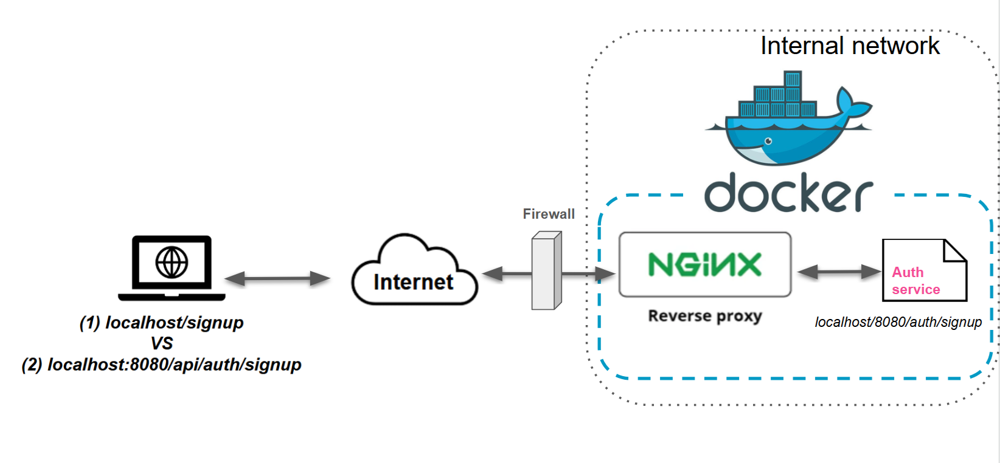

# Frontend
The frontend service is a React-based web application for the MLA Fitness App. It provides an interactive user interface for tracking exercises, monitoring progress, managing recipes, and more. It uses environment variables for flexible configuration and supports CI/CD workflows for seamless deployment.

## Table of Contents

- [Intro](#intro)
- [Setup](#setup)
- [Environment Variables](#environment-variables)
- [Project Structure](#project-structure)
    - [Centralized API Calls](#centralized-api-calls)
        - [Available API Functions](#available-api-functions)
    - [NGINX Configuration and Usage](#nginx-configuration-and-usage)
    - [Nginx integration](#nginx-integration)
    - [Reusable Components](#reusable-components)
    - [Utils Folder](#utils-folder)
    - [Routing Enhancements](#routing-enhancements)
    - [Unit and Integration Tests](#unit-and-integration-tests)
    - [Focus on Error Handling](#focus-on-error-handling)
        - [Error Handling](#error-handling)
- [Running the Application](#running-the-application)
- [Role of NGINX in the Frontend](#role-of-nginx-in-the-frontend)
- [Running Tests and linting](#running-tests-and-linting)
- [Accessibility standards](#accessibility-standards)
     - [Accessibility in routing](#accessibility-in-routing)


### Intro
The frontend service is a React-based web application for the MLA Fitness App. It provides an interactive user interface for tracking exercises, monitoring progress, managing recipes, and more. It uses environment variables for flexible configuration and supports CI/CD workflows for seamless deployment.

### Setup
The frontend is built with create-react-app and uses Node.js for dependency management.

**Quickstart: Set up the project**
Clone the repository and navigate to the frontend directory:
```sh
git clone <repository-url>
cd frontend
```
**Install dependencies using npm:**
```sh
npm install
```

**Start the development server:**
```sh
npm start
```

**NOTE:**
By default, when running the app outside of docker-compose it will be available at `http://localhost:3000`.
- inside docker-compose, you will need to go to `http://localhost:80` which is the Docker container that frontend and nginx use locally.

[Back to Table of Contents](#table-of-contents)

### Environment Variables
The app uses .env files for environment configuration. These variables are injected during build time and control the application's behavior.

[Back to Table of Contents](#table-of-contents)

### Project Structure
The key directories and files in the project are:

```text

frontend/
├── public/                # Static files
├── src/
│   ├── components/        # Reusable React components (e.g., Navbar, Login)
│   ├── pages/             # Page-level components (e.g., Statistics, Recipes)
│   ├── api/               # Axios API calls (e.g., trackExercise, loginUser)
│   ├── utils/             # Utility functions (e.g., error handling)
│   ├── tests/             # Unit and integration tests
│   ├── App.js             # Main app component
│   ├── index.js           # Entry point
│   └── jest.setup.js      # Jest setup file for testing
├── .env                   # Default environment variables
├── package.json           # Project metadata and scripts
└── Dockerfile             # Docker configuration

```

#### Centralized API Calls
To improve maintainability and consistency, all API calls have been centralized in the `src/api.js` file.

This approach ensures:
- Single Source of Truth for API URLs and functions.
- Simplified API management, where changes to endpoints or configurations can be made in one place.
- Better separation of concerns between components and data-fetching logic.

##### Available API Functions:
- `loginUser`: Authenticates a user.
- `signupUser`: Registers a new user.
- `trackExercise`: Adds a new exercise.
- `fetchStatistics`: Retrieves filtered statistics using GraphQL.
- `fetchRecipes()`: Fetches recipes

#### NGINX Configuration and Usage

NGINX is utilized in the frontend service to manage multiple roles:
1. Serving static files
    - Serves the static files generated by the React build process (e.g., `index.html`, CSS, JavaScript files).
    - Configured to cache static files for improved performance using a 1-day expiry
2. Reverse proxy
    - Acts as a gateway to route API requests to their respective backend microservices.
    - This simplifies the frontend's configuration, allowing API calls to be made relative to the same domain (e.g., `/api/activity`), while NGINX forwards these requests to the appropriate service.
3. React Router Support
    - Handles client-side routing by redirecting requests for paths not matching a file or directory (e.g., `/trackExercise`) to `index.html`.
    - This ensures that React Router can handle navigation properly within the single-page application.



**Local Development and Docker Integration**
In the development environment:

Docker Compose mounts the NGINX configuration (`nginx.conf`) into the container, ensuring real-time updates to the NGINX setup without rebuilding the container.
The frontend service is accessible at `http://localhost:80`.
**Example Proxy Routes**
The following API requests are proxied by NGINX to the corresponding backend services:

- `/api/activity/` → `http://activity-tracking:5300/`
- `/api/analytics/` → `http://analytics:5050/analytics/`
- `/api/recipes/` → `http://recipes:5051/recipes/`
- `/api/auth/` → `http://authservice:8080/`
These routes are defined in `nginx.conf` and ensure that API calls are seamlessly forwarded to the correct backend service.

**Benefits of Using NGINX**
- Centralized CORS Management: NGINX handles Cross-Origin Resource Sharing (CORS) headers centrally, simplifying the configuration across microservices.

**Improved Performance**: Caching for static files reduces load times and improves the user experience.

**Simplified Deployment**: By combining static file serving and API routing, NGINX reduces the complexity of managing multiple services.

**Deployment with Docker Compose**
- The Dockerfile for the Frontend builds the React app and places the static files into the NGINX container.
- In the `docker-compose.develop.yml` file, the frontend service binds port 3000 on the host to port 80 in the NGINX container, making the app accessible at `http://localhost:80` in local development.


#### Reusable Components
The application is modularized, with reusable components such as NavbarComponent, Footer, Login, and others located in the `src/components` folder. These components focus on specific UI or functionality to enhance readability and reusability.

#### Utils Folder
The utils folder contains utility functions and components that are reused across the application.

**Helper functions:**
- `customDateInput.js`: Defines a reusable CustomDateInput component for integrating a custom date picker input with React. This component is used as the customInput in react-datepicker to maintain consistent styling and accessibility.
- `ErrorBoundary.js`: A React error boundary to catch runtime errors and display fallback UI.
- `errorHandle.js`: Provides the getErrorMessage function to standardize error handling across the application. This function parses error responses and returns user-friendly messages based on the HTTP status code or context.
- `test-utils.js`: Custom utilities for testing, including an enhanced render method using MemoryRouter for React Router testing.

#### Routing Enhancements
Routing is managed using react-router-dom and includes dynamic redirects based on authentication status:

- Unauthenticated users are redirected to `/login`.
- Authenticated users have access to protected routes like `/trackExercise`, `/statistics`, `/journal`, and `/recipes`.

#### Unit and Integration Tests
 - unit tests: api test, alt text test
 - integration tests: all components tests, accessibility tests


#### Focus on Error Handling
The application includes error handling strategies to improve user experience:

- Error Boundary Component (`ErrorBoundary.js`): Wraps key components to catch and display runtime errors.
- API Error Handling: Utilizes `getErrorMessage` from `utils/errorHandle.js` to standardize error responses and display user-friendly messages.
- Fallback Pages: Displays messages like `"Sorry, no recipes found"` or a generic error message when API calls fail.
##### Error Handling
An ErrorBoundary component (located in `src/utils/ErrorBoundary.js`) has been added to handle uncaught errors gracefully, ensuring better user experience and debugging.

[Back to Table of Contents](#table-of-contents)

### Running the Application

**Start the Development Server**
- `npm start`

By default, the app will be available at `http://localhost:3000`. This is the development server provided by `create-react-app` and is intended for local development without using Docker.

**Build for Production**
- `npm run build`

**Running the Application in Docker**
When running in Docker, the frontend is served via NGINX on port 80 (mapped to port 3000 in the container). This setup is optimized for testing the app in an environment closer to production, where NGINX handles static file serving and API proxying.

Use Docker Compose to build and run the app:
`docker-compose -f docker-compose.develop.yml up --build`

[Back to Table of Contents](#table-of-contents)

### Role of NGINX in the Frontend

NGINX serves as an integral part of the frontend by acting as a reverse proxy and static file server. Here's how it supports the frontend:

- **Static File Serving**
- **API Proxying**
    -   NGINX routes API requests to the corresponding backend microservices. For instance:
        -`/api/activity/` requests are proxied to the Activity Tracking Service at `http://activity-tracking:5300`.
        - `/api/recipes/` requests are proxied to the Recipes Service at `http://recipes-service:5051`.
       This setup abstracts the backend service details from the frontend, making it easier to manage and scale.
- **Centralized CORS Management**
    - NGINX applies Cross-Origin Resource Sharing (CORS) policies to API requests. This centralized configuration simplifies the CORS handling process and ensures consistent rules across all endpoints.
- **Performance Optimization**
    - NGINX employs caching for static assets, such as CSS and JavaScript files, to reduce load times and improve the user experience. It includes headers like `Cache-Control` to enable client-side caching

[Back to Table of Contents](#table-of-contents)

### Running Tests and linting

**Running the Test Suite**
- `npm run test`
**Run specific test**
-`npm run test src/__tests__/components/<test-file-name>`

**Running ESLint**
`npm run lint`

**Fixing Lint Issues**
`npm run lint:fix`

[Back to Table of Contents](#table-of-contents)

### Accessibility standards
Accessibility is a key focus in this application. Features implemented include:

- **Keyboard Navigation**: Every interactive element supports proper Tab and Shift+Tab navigation.
- **Focus Management**: Critical components like forms, navigation bars, and modals ensure correct focus handling.
- **Fallback UI**: Provides accessible and consistent error messages, ensuring a user-friendly experience for scenarios such as missing recipes or API errors.
- **Alt Text**: All images have descriptive alt attributes to enhance screen reader compatibility.


#### Accessibility in routing
Dynamic routing ensures smooth user flows:

- Protected Routes: Redirects unauthenticated users to `/login`
- Public Routes: Pages like Signup and Login are accessible without authentication
- Dynamic Redirects: Upon successful login, users are redirected to their intended destination (e.g., `/statistics` or `/recipes`)

**Accessible Route Design**

- Word Separators: All API routes and endpoints use clear delimiters (`/`) to ensure readability and compatibility with screen readers
- Descriptive Names: Routes such as `/api/activity/` and `/api/recipes/` are descriptive, avoiding cryptic or abbreviated terms
- Avoiding Abbreviations: The `/api/auth/` route could be renamed to `/api/authentication/` for enhanced clarity and accessibility at a later stage

[Back to Table of Contents](#table-of-contents)
